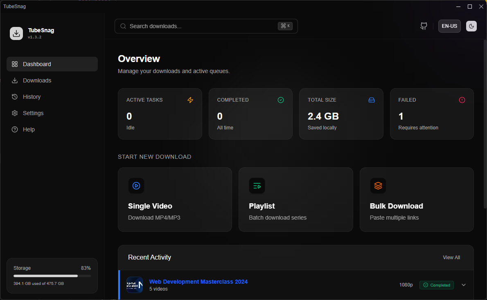
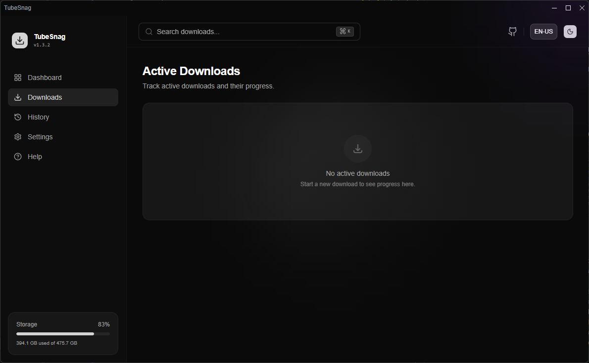
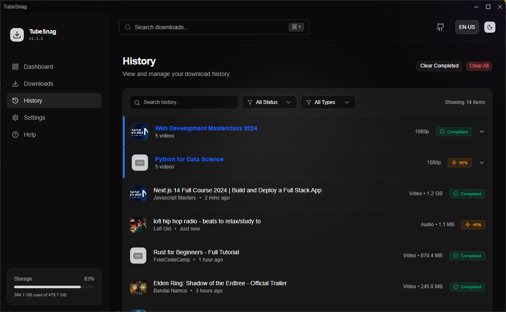

# TubeSnag Desktop

> ⚠️ **This project is currently under active development.** Features and APIs may change.

<div align="center">
  
  <p>A modern Electron desktop application for downloading videos, music, and playlists from YouTube using yt-dlp.</p>
</div>

---

## Screenshots

| Main Interface | Download Manager                                     | Download History                                     |
|---|------------------------------------------------------|------------------------------------------------------|
|  |  |  |

## Features

- **Video Downloads**: Download videos, music, and playlists from YouTube
- **Format Selection**: Choose between different quality levels (best, high, medium, low) and formats (mp4, mkv, webm, mp3, wav)
- **Thumbnail Management**: Automatically downloads and converts thumbnails to WebP format
- **Multi-language Support**: Built-in internationalization (i18n) support
- **Dark/Light Theme**: Toggle between dark and light themes
- **Download Management**: Track active downloads and view download history
- **Storage Monitoring**: Real-time disk usage statistics
- **FFmpeg Integration**: Built-in FFmpeg support for media processing

## Tech Stack

- **Framework**: Electron 40.6.0
- **UI**: React 19.2.4 with TypeScript
- **Styling**: Tailwind CSS 4.1.18
- **State Management**: Redux Toolkit
- **Routing**: TanStack Router
- **Build Tool**: Vite
- **Code Quality**: Biome

## Prerequisites

- Node.js (v18 or higher)
- npm or yarn

## Installation

```bash
npm install
```

## Development

Start the development server:

```bash
npm start
```

## Building

Package the application:

```bash
npm run package
```

Create installers:

```bash
npm run make
```

## Project Structure

```
src/
├── actions/          # Redux actions
├── components/       # React components
├── context/          # React context providers
├── hooks/            # Custom React hooks
├── ipc/              # Electron IPC handlers
├── localization/     # i18n configuration
├── routes/           # TanStack Router routes
├── store/            # Redux store configuration
├── styles/           # Global styles
├── types/            # TypeScript type definitions
└── utils/            # Utility functions
```

## Scripts

- `npm start` - Start development server
- `npm run package` - Package the application
- `npm run make` - Create installers
- `npm run check` - Run code quality checks
- `npm run fix` - Fix code quality issues
- `npm run bump-ui` - Update UI components

## License

Apache-2.0

## Author

Shawan Mandal
