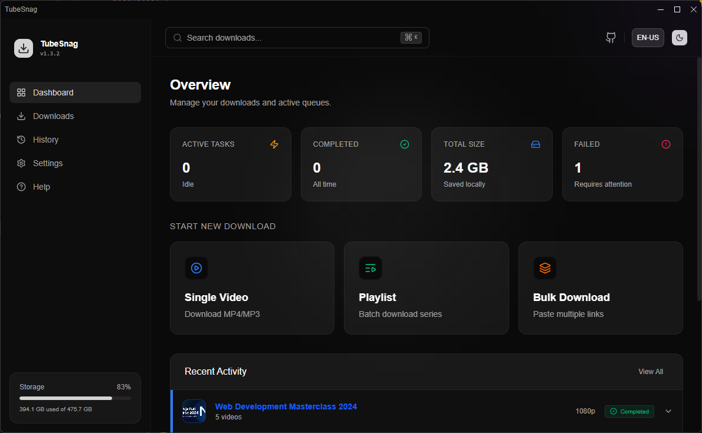
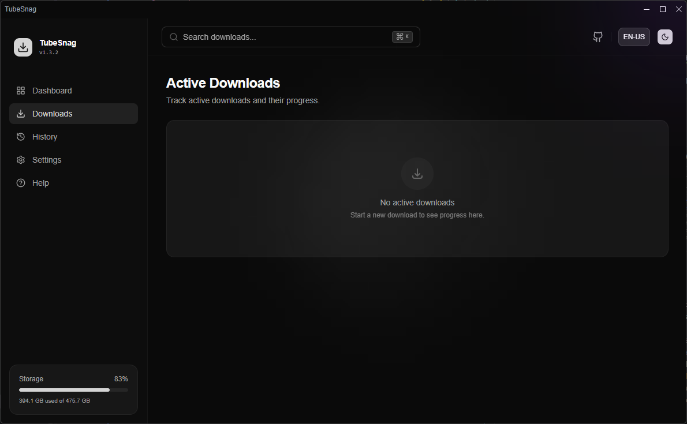
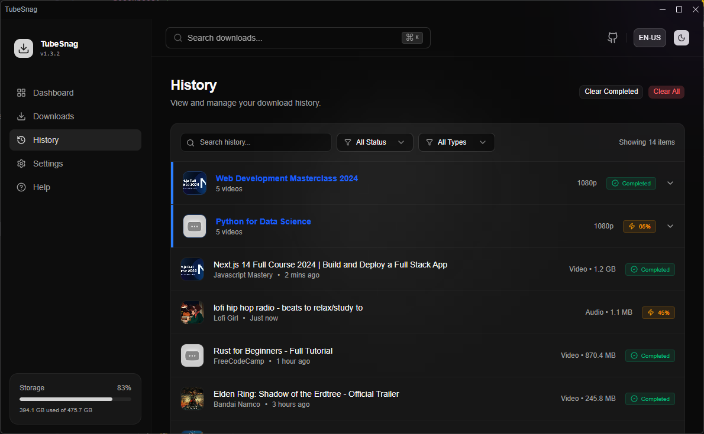

<div align="center">
  
  <h1>TubeSnag Desktop</h1>
  <p><b>A modern, privacy-first, cross-platform media extraction and management client.</b></p>

  [](#)
  [](#)
  [](#)
  [](#)
  [](#)
</div>

---

## Overview

**TubeSnag** is an enterprise-grade desktop application engineered for high-performance downloading of videos, music, and entire playlists from YouTube. Built on top of the industry-standard `yt-dlp` and `FFmpeg` engines, TubeSnag provides a seamless, native GUI experience without compromising on the advanced configurations demanded by power users.

Designed with an uncompromising stance on data sovereignty, TubeSnag operates **100% locally**. There is no telemetry, no cloud syncing, and no user tracking. All operations, metadata, and history are securely managed on your local machine via an embedded SQLite database.

---

## Table of Contents

1. [Architecture Overview](#architecture-overview)
2. [Core Features & Interface](#core-features--interface)
3. [Security & Privacy](#security--privacy)
4. [Developer Onboarding](#developer-onboarding)
5. [Build & Distribution](#build--distribution)
6. [Project Governance](#project-governance)
7. [License](#license)

---

## Architecture Overview

TubeSnag strictly adheres to the Electron multi-process architecture, isolating the frontend presentation layer from the Node.js backend environment for enhanced security and performance.

### Technology Stack
* **Application Framework:** Electron `v40.6.0`
* **Presentation Layer:** React `v19` (Babel React Compiler), Tailwind CSS `v4.1`
* **State Management:** Redux Toolkit (Global), TanStack Router (Navigation)
* **Media Processing:** Embedded `yt-dlp` (Extraction), `ffmpeg-static` (Transcoding/Muxing)
* **Data Persistence:** SQLite3 (Local metadata and history state)
* **Build Pipeline:** Vite, Electron Forge

### Inter-Process Communication (IPC)
The application utilizes context-isolated IPC channels to bridge the React UI with the Node.js main process. All file system operations, database transactions, and sub-process spawns (e.g., executing `yt-dlp` pipelines) are securely brokered through a hardened `preload.js` script.

---

## Core Features & Interface

TubeSnag combines a robust backend extraction engine with a highly polished, native user interface.

| Dashboard & Overview | Active Download Manager | Historical Library |
|:---:|:---:|:---:|
|  |  |  |

### Features

* **Concurrent Processing Pipeline:** Supports bulk URL ingestion and concurrent playlist downloading, utilizing multi-threading to maximize host bandwidth.
* **Granular Quality Selection:** Dynamic resolution targeting from highly-compressed standard definition (360p) up to lossless 4K/8K HDR, dependent on source availability.
* **Audio Extraction & Transcoding:** Dedicated pipelines for stripping video containers to yield high-fidelity audio formats (MP3, M4A, WAV) with configurable bitrates (128kbps – 320kbps).
* **Automated Asset Management:** Asynchronous fetching and WebP conversion of media thumbnails, alongside automated playlist subdirectory routing.
* **Internationalization (i18n):** Deeply integrated localization architecture currently supporting English and Hindi (`hi`), easily extensible for additional locales.
* **State Recovery:** SQLite-backed history tracking allows for the querying, filtering, and resuming of failed network operations.

---

## Security & Privacy

TubeSnag is designed for zero-trust environments and users with strict data sovereignty requirements.

* **Zero Telemetry:** The application contains no analytics, tracking pixels, or remote crash reporting.
* **Local Execution:** 100% of the application state (including the SQLite database, logs, and downloaded assets) remains on the host machine.
* **No Cloud Dependency:** Outside of the direct HTTPS connections established to target media servers for file retrieval, TubeSnag makes no external network requests.

---

## Developer Onboarding

### System Requirements
* Node.js `>= 18.x`
* npm `>= 9.x` or Yarn `>= 1.22.x`
* Git
* *Note: Python 3.x may be required on your host system depending on your OS to compile the `sqlite3` native bindings during `npm install`.*

### Environment Setup

1. **Clone the repository:**
   ```bash
   git clone [https://github.com/imshawan/tubesnag-desktop.git](https://github.com/imshawan/tubesnag-desktop.git)
   cd tubesnag-desktop
   ```
2.  **Install dependencies:**
    ```
    npm install
    
    ```
    
3.  **Initialize the development server:** This will concurrently spin up the Vite development server and the Electron host.
    ```
    npm start
    
    ```

----------

## Build & Distribution

The build pipeline is managed via Electron Forge, integrating Vite for frontend asset bundling.

### Local Packaging

To compile the application binaries for your current host architecture without building system-specific installers:
```
npm run package

```

### Installer Generation

To generate distributable artifacts (e.g., `.dmg`, `.exe`, `.deb`, `.rpm`):
```
npm run make

```

_Artifacts will be output to the `out/` directory._

### Code Quality Enforcement

TubeSnag utilizes Ultracite and Biome for strict AST parsing and code formatting. PRs will fail CI if these checks do not pass.
```
npm run check    # Run static analysis
npm run fix      # Auto-correct format violations

```

----------

## Project Governance

### Issue Tracking

Please utilize the GitHub Issue Tracker to report bugs or request features. Ensure you include:

1.  Host OS and Version
    
2.  TubeSnag version
    
3.  Steps to reproduce (for bug reports)
    
4.  Relevant application logs
    

### Contributing

We welcome merge requests from the community. Please refer to our [`CONTRIBUTING.md`](CONTRIBUTING.md) for strict commit-message formats, branching strategies, and testing requirements prior to submitting a PR.

----------

## License

Copyright © 2026 Shawan Mandal.

This project is licensed under the terms of the [Apache License 2.0](https://opensource.org/licenses/Apache-2.0).
   
